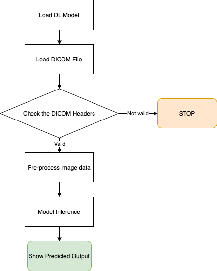
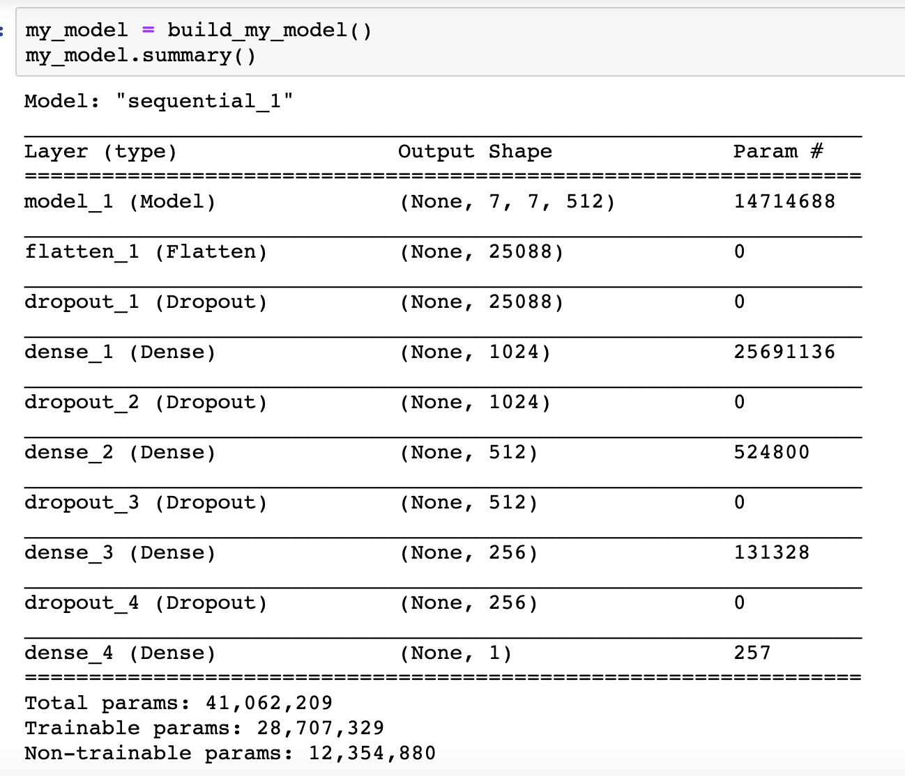
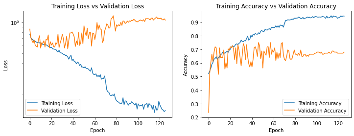
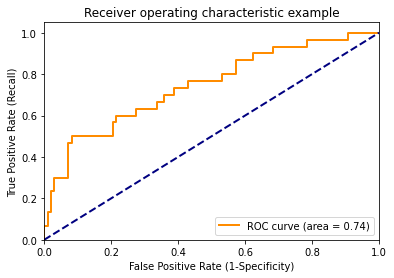
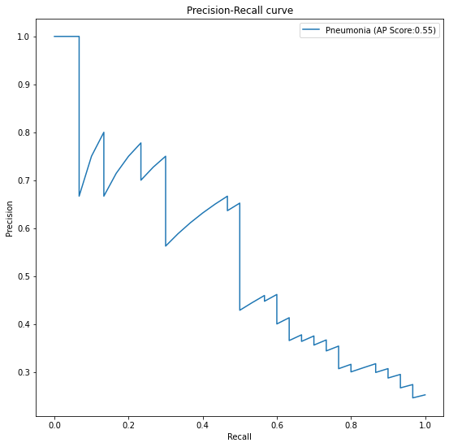
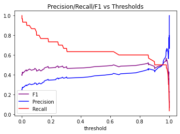

# FDA  Submission

**Your Name:** Nongnooch Roongpiboonsopit

**Name of your Device:** Pneumonia classifier for an X-ray image

## Algorithm Description 

### 1. General Information

**Intended Use Statement:** 
Assisting a radiologist with identifying suspicious Pneumonia in an X-ray Image

**Indications for Use:**
Indicated for use in screening mammography studies in a Male and Female patient with age less than 100. 

This algorithm must be run with a machine with GPU and the NVidia CUDA Version 11.0 installed.

**Device Limitations:**

Device limitations, including diseases/conditions/abnormalities for which the device has been found ineffective and should not be used

* This algorithm can perform poorly with a bright X-ray image and an X-ray image for the 'Infiltration', 'Effusion', and 'Atelectasis' diseases.

**Clinical Impact of Performance:**

When this algorithm misclassifies an X-ray image,
* If it mis-classifies a positive case as negative (False Negative), a radiologist could miss a suspicious binding to identify Pneumonia in an X-ray image.
* If it mis-classifies a negative case as positive (False Positive), a radiologist could incorrectly identify an area in an X-ray image as Pneumonia when there is none.

### 2. Algorithm Design and Function

Below is a flowchart for this algorithm:

**DICOM Checking Steps:**

After loading a DICOM file, before proceeding to the next step, the following DICOM Header attributes must be validated:
* 'PatientPosition' attribute must be either 'AP' or 'PA'
* 'Modality' attribute must be 'DX'
* 'BodyPartExamined' attribute must be either 'CHEST' or 'RIBCAGE'.

**Preprocessing Steps:**

* Image data is rescaled to the interval [0,1]
* Reshape and resize the image to (batch, height, width, channels)=(1, 224, 224, 3)

**CNN Architecture:**

The fully connected layers of the vgg16 network pretrained on ImageNet are replaced with new fully connectected layers where a dropout layer is added after each fully connected layer except the last layer which output a single output as shown below:

### 3. Algorithm Training

**Parameters:**
* The following types of image augmentation used during training
  * Rescale image to the [0, 1] interval
  * Random horizontal flip
  * Random height shift range (0.05)
  * Random width shift range (0.1)
  * Random rotation range (5 degree)
  * Random shear range (0.1)
  * Random zoom range (0.05)
* Training Batch size: 128
* Optimizer: Adam
  * Learning rate: 0.0002 (decayed by a factor of 0.25 each time the training loss plateaus after 3 epochs)
  * Standard parameters (beta_1=0.9, beta_2=0.999, epsilon=1e-07)
* Pre-trainined VGG16 network trained on ImageNet are used and the layers up to the 'block5_pool' layer are frozen
* Replace the layers after the the 'block5_pool' layer are replaced by the following fully connected layers:
  * Flatten lay
  * Dropout layer (p=0.5)
  * Fully Connected layer (1024)
  * Dropout layer (p=0.5)
  * Fully Connected layer (512)
  * Dropout layer (p=0.2)
  * Fully Connected layer (256)
  * Dropout layer (p=0.2)
  * Fully Connected layer (1)

The charts below show the model performance during the transfer-learning process. Since we monitored the training loss and applied the EarlyStopping when the training loss is plateaued after 10 epochs, this model stopped learning at the 125 epoch when the training loss was plateaued at 0.13153.

**Final Threshold and Explanation:**

The ROC curve below shows that the AUC value of the predicted outputs from this model is 0.74 which means that there is 74% chance that this model will be able to distinguish between a positive case (an x-ray image with Pneumonia) and a negative case (an x-ray image without Pneumonia)

The Precision-Recall curve below shows the tradeoff between Precision and Recall for different threshold and it has an average precision value of 0.55. 
* Precision should be optimized when we care most about the confidence when a predicted output is a positive result. If a threshold value is selected such that the algorithm has a high precision and a low recall, the algorithm will have a low False Positive rate but it does not take into account False Negatives and it could miss a lot of positive cases. 
  * In a clinical setting, an application with a high precision score is used to confirmed a suspected diagnostic.
* Recall should be optimized to rule out disease since a high recall score gives a high confidence that a predicted negative result is truely negative. If a threshold value is selected such that the algorithm has a low precision and a high recall, the algorithm will have a low False Negative rate but it does not take into account False Positives and your algorithm may misclassify a lot of negative results as positives. 
  * Clinical applications for high recall tests are good for screening studies or worklist prioritization to ensure that patients with a disease is prioritized.

Since this algorithm is intended to assist a radiologist with identifying suspicious Pneumonia in an X-ray Image, the algorithm needs a higher recall score to ensure that it does not miss many positive cases (X-ray images with Pneumonia). 

Hence, a threshold value of 0.85 is selected for this algorithm since it provides a higher recall score (0.6) and a good balance between a recall score (0.6) and a precision score (0.45) with a high F1 score (0.51), which is a better measure for a test accuracy when there are class imbalances, as shown in a chart below.

### 4. Databases
The dataset used to train this model was retrieved from [kaggle website](https://www.kaggle.com/nih-chest-xrays/data).

There are 112,120 X-ray images with disease labels from 30,805 unique patients in this dataset. The labels include 14 common thoracic pathologies: 
- Atelectasis 
- Consolidation
- Infiltration
- Pneumothorax
- Edema
- Emphysema
- Fibrosis
- Effusion
- Pneumonia
- Pleural thickening
- Cardiomegaly
- Nodule
- Mass
- Hernia 

In addition,
* This dataset is filtered to patients with an age less than 100 which reduced a number of records to 112,104. 
* There are 1,430 positive cases (X-ray images with 'Pneumonia' in the label) which is account 1.275% of a number of records in this dataset
* The interquartile range of the patien age in this dataset is 35 to 59 where 56.5% and 43.5% of the records are from Male and Female patients, respectively.
* 60% and 40% of the X-ray images are taken from the PA and AP views, respectively.
* 22.5% of X-ray images with Pneumonia are only labeled as Pneumonia, and the remaining 77.5% of X-ray images with Pneumonia are labeled with other diseases. Below are the top 3 co-occurrence diseases that are labeled with Pneumonia: 
  * 199 X-ray images with Pneumonia (13.9%) are labeled with "Infiltration"
  * 137 X-ray images with Pneumonia (9.6%) are labeled with "Edema" and "Infiltration"
  * 108 X-ray images with Pneumonia (7.6%) are labeled with "Atelectasis"

The dataset is split to Training and Validation datasets which split the records with a positive case (a X-ray image with Pneumonia) with the 80:20 ratio.

**Description of Training Dataset:** 
After having an intitial training dataset with 80% of the overall positive cases present, negative-case records are randomly removed to maintain an EQUAL amount of positive and negative cases in the training dataset. The training dataset contains 2,288 X-ray images where 50% of those images are positive cases.

**Description of Validation Dataset:** 
After having an intitial training dataset with 20% of the overall positive cases present, negative-case records are randomly removed to maintain 20:80 ratio between positive and negative cases in the validation dataset. The validation dataset contains 1,430 X-ray images where 20% of those images are positive cases.

### 5. Ground Truth

The disease labels were created using Natural Language Processing (NLP) to mine the associated radiological reports. The original radiology reports are not publicly available but you can find more details on the labeling process [here.](https://arxiv.org/abs/1705.02315) 

Then, a ground truth data checking for a text 'Pneumonia' in the label of each record and extract this data (True/False) to a new variable  called 'pneumonia_class'

The main benefit of using this NIH dataset is that the X-ray images are already labeled by radiologists. However, the biggest limitation of this dataset is that image labels were NLP-extracted so there could be some erroneous labels but the NLP labeling accuracy is estimated to be >90%.

### 6. FDA Validation Plan

**Patient Population Description for FDA Validation Dataset:**
The ideal dataset for this algorithm would be X-ray images of Male and Female patients with age between 1-100 that are taken from the PA or AP position and it must contain at least a 1.275% prevalence of Pneumonia in the dataset.

**Ground Truth Acquisition Methodology:**

An optimal ground truth can be obtained from the radiologist labels of the X-ray images in the dataset. 

**Algorithm Performance Standard:**

[This paper](https://arxiv.org/pdf/1711.05225.pdf) reports an F1 score of their algorithm (CheXNet) of 0.435 with 95% CI (0.387, 0.481) which shows that it is statistically significantly higher than an average of 0.387 with 95% CI (0.330, 0.442) from 4 radioogists.

Hence, this algorithm must show that it can predict the output for the FDA Validation Dataset with an F1 score which is statistically equal or significantly higher than the F1 score reported by the CheXNet algorithm in the [paper](https://arxiv.org/pdf/1711.05225.pdf)  which is 0.435 with 95% CI (0.387, 0.481).